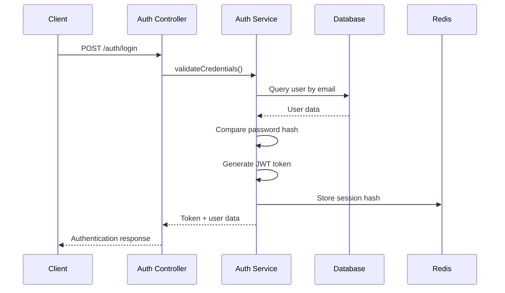
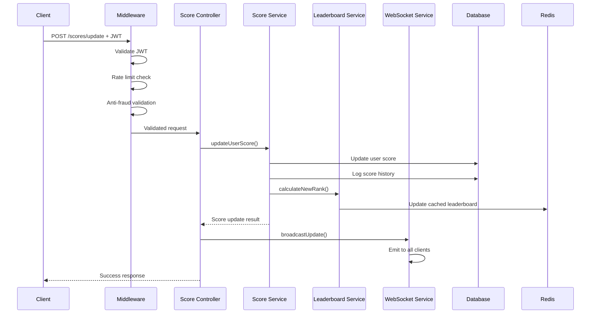
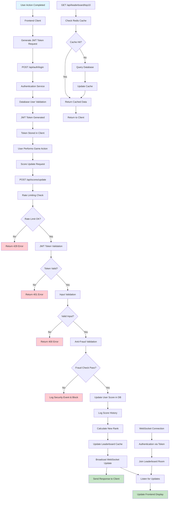

# Scoreboard API - System Architecture

## High-Level Architecture

The Scoreboard API follows a layered architecture pattern with clear separation of concerns:

```
┌───────────────────────────────────────────┐
│               Load Balancer               │
│            (nginx/HAProxy)                │
└─────────────────┬─────────────────────────┘
                  │
┌─────────────────▼─────────────────────────┐
│           API Gateway/Router              │
│         (Express.js Routes)               │
└─────┬───────────────────────────┬─────────┘
      │                           │
┌─────▼─────┐               ┌─────▼─────┐
│  HTTP API │               │ WebSocket │
│ Endpoints │               │  Service  │
└─────┬─────┘               └─────┬─────┘
      │                           │
┌─────▼───────────────────────────▼─────────┐
│           Middleware Layer                │
│  ┌─────────┐ ┌──────────┐ ┌──────────┐    │
│  │  Auth   │ │   Rate   │ │Anti-Fraud│    │
│  │Validate │ │ Limiting │ │ Validate │    │
│  └─────────┘ └──────────┘ └──────────┘    │
└─────────────────┬─────────────────────────┘
                  │
┌─────────────────▼─────────────────────────┐
│            Service Layer                  │
│  ┌──────────┐ ┌─────────┐ ┌────────────┐  │
│  │   Auth   │ │  Score  │ │Leaderboard │  │
│  │ Service  │ │ Service │ │ Service    │  │
│  └──────────┘ └─────────┘ └────────────┘  │
└─────────────────┬─────────────────────────┘
                  │
┌─────────────────▼─────────────────────────┐
│            Data Layer                     │
│  ┌──────────┐           ┌─────────────┐   │
│  │PostgreSQL│           │    Redis    │   │
│  │(Primary) │           │  (Cache &   │   │
│  │          │           │Rate Limit)  │   │
│  └──────────┘           └─────────────┘   │
└───────────────────────────────────────────┘
```

## Component Interaction Flow

### 1. User Authentication Flow


### 2. Score Update Flow


### 3. Real-time Leaderboard Flow



## Security Architecture

### Multi-Layer Security Model

1. **Network Layer**
   - HTTPS/TLS encryption for all communications
   - IP-based rate limiting and DDoS protection
   - Geographic filtering if needed

2. **Application Layer**
   - JWT token-based authentication
   - Request size limitations (1KB max)
   - Input validation and sanitization
   - CORS policy enforcement

3. **Business Logic Layer**
   - Anti-fraud validation middleware
   - Action type whitelisting
   - Score increase bounds checking
   - Timestamp validation (replay attack prevention)

4. **Data Layer**
   - Database connection encryption
   - Prepared statements (SQL injection prevention)
   - Data access logging and monitoring

### Token Security Strategy

```javascript
// JWT Payload Structure
{
  "id": 12345,
  "username": "player1",
  "email": "player@example.com",
  "iat": 1642176000,    // Issued at
  "exp": 1642262400,    // Expires at (24h)
  "iss": "scoreboard-api", // Issuer
  "aud": "scoreboard-client" // Audience
}
```

### Rate Limiting Strategy

```javascript
// Multi-tier rate limiting
const rateLimits = {
  global: {
    windowMs: 15 * 60 * 1000, // 15 minutes
    max: 1000 // requests per window per IP
  },
  authentication: {
    windowMs: 5 * 60 * 1000,  // 5 minutes
    max: 5 // login attempts per window
  },
  scoreUpdate: {
    windowMs: 60 * 1000, // 1 minute
    max: 10 // score updates per minute per user
  },
  leaderboard: {
    windowMs: 60 * 1000, // 1 minute
    max: 60 // leaderboard requests per minute
  }
};
```

## Real-Time Communication Architecture

### WebSocket Implementation

The WebSocket service uses Socket.IO for real-time communication with the following features:

1. **Connection Management**
   - JWT-based authentication for WebSocket connections
   - Room-based message distribution (leaderboard room)
   - Connection limits (max 1000 concurrent connections)
   - Automatic reconnection handling

2. **Message Types**
   - `leaderboard_updated`: Broadcast to all subscribed clients
   - `user_score_updated`: Personal updates to specific users
   - `connection_status`: Connection state management

3. **Scalability Considerations**
   - Redis adapter for multi-instance Socket.IO
   - Message broadcasting optimization
   - Connection pooling and cleanup

## Database Architecture

### PostgreSQL Schema Design

#### Optimized for Read Performance
```sql
-- Primary table with optimized indexes
CREATE TABLE users (
    id SERIAL PRIMARY KEY,
    username VARCHAR(50) UNIQUE NOT NULL,
    email VARCHAR(100) UNIQUE NOT NULL,
    password_hash VARCHAR(255) NOT NULL,
    total_score BIGINT DEFAULT 0,
    last_action_timestamp TIMESTAMP DEFAULT CURRENT_TIMESTAMP,
    created_at TIMESTAMP DEFAULT CURRENT_TIMESTAMP,
    updated_at TIMESTAMP DEFAULT CURRENT_TIMESTAMP
);

-- Critical index for leaderboard queries
CREATE INDEX idx_users_score_desc ON users (total_score DESC);
CREATE INDEX idx_users_last_action ON users (last_action_timestamp);
```

#### Audit Trail for Security
```sql
-- Comprehensive scoring history
CREATE TABLE score_history (
    id SERIAL PRIMARY KEY,
    user_id INTEGER REFERENCES users(id),
    score_delta INTEGER NOT NULL,
    action_type VARCHAR(50) NOT NULL,
    action_metadata JSONB,
    client_timestamp TIMESTAMP NOT NULL,
    server_timestamp TIMESTAMP DEFAULT CURRENT_TIMESTAMP,
    ip_address INET,
    user_agent TEXT
);

-- Indexes for security analysis
CREATE INDEX idx_score_history_user_time ON score_history (user_id, server_timestamp DESC);
CREATE INDEX idx_score_history_ip ON score_history (ip_address, server_timestamp DESC);
CREATE INDEX idx_score_history_action_type ON score_history (action_type);
```

### Redis Caching Strategy

#### Cache Layers
```javascript
// Cache configuration
const cacheConfig = {
  leaderboard: {
    key: 'leaderboard:top10',
    ttl: 30, // 30 seconds
    refreshThreshold: 10 // seconds before expiry
  },
  userScore: {
    keyPattern: 'user_score:{userId}',
    ttl: 300, // 5 minutes
    refreshOnUpdate: true
  },
  rateLimits: {
    keyPattern: 'rate_limit:{type}:{identifier}',
    ttl: 'dynamic', // based on window size
    sliding: true
  }
};
```

## Performance Optimization

### Database Optimization

1. **Query Optimization**
   - Indexed queries for leaderboard retrieval
   - Optimized ranking calculations
   - Connection pooling (min: 2, max: 20)

2. **Scaling Strategy**
   - Read replicas for leaderboard queries
   - Write master for score updates
   - Database partitioning for score history

### Caching Strategy

1. **Multi-Level Caching**
   - Application-level caching (Redis)
   - Database query result caching
   - CDN for static assets

2. **Cache Invalidation**
   - Time-based expiration
   - Event-driven invalidation
   - Intelligent cache warming

### WebSocket Optimization

1. **Connection Management**
   - Efficient room management
   - Message batching for bulk updates
   - Connection cleanup on disconnect

2. **Message Optimization**
   - Selective broadcasting (only to relevant clients)
   - Message compression for large payloads
   - Throttling for high-frequency updates

## Monitoring and Observability

### Application Metrics

1. **Performance Metrics**
   - Request latency (p50, p95, p99)
   - Throughput (requests per second)
   - Error rates by endpoint
   - WebSocket connection metrics

2. **Business Metrics**
   - Score update frequency
   - Leaderboard position changes
   - User activity patterns
   - Fraud detection alerts

### Health Checks

```javascript
// Health check endpoints
app.get('/health', (req, res) => {
  res.json({
    status: 'healthy',
    timestamp: new Date().toISOString(),
    services: {
      database: await checkDatabaseHealth(),
      redis: await checkRedisHealth(),
      websocket: getWebSocketStatus()
    }
  });
});
```

### Logging Strategy

```javascript
// Structured logging with different levels
const logger = winston.createLogger({
  format: winston.format.combine(
    winston.format.timestamp(),
    winston.format.json()
  ),
  transports: [
    new winston.transports.File({ 
      filename: 'logs/error.log', 
      level: 'error' 
    }),
    new winston.transports.File({ 
      filename: 'logs/security.log',
      level: 'warn',
      format: winston.format.combine(
        winston.format.label({ label: 'SECURITY' }),
        winston.format.json()
      )
    }),
    new winston.transports.Console({
      level: 'info',
      format: winston.format.simple()
    })
  ]
});
```

## Deployment Architecture

### Container Strategy

```dockerfile
# Multi-stage build for production optimization
FROM node:18-alpine AS builder
WORKDIR /app
COPY package*.json ./
RUN npm ci --only=production

FROM node:18-alpine AS runtime
WORKDIR /app
COPY --from=builder /app/node_modules ./node_modules
COPY src ./src
EXPOSE 3000
CMD ["node", "src/app.js"]
```

### Environment Configuration

```yaml
# docker-compose.yml for development
version: '3.8'
services:
  api:
    build: .
    ports:
      - "3000:3000"
    environment:
      - NODE_ENV=development
      - DATABASE_URL=postgresql://user:pass@db:5432/scoreboard
      - REDIS_URL=redis://redis:6379
    depends_on:
      - db
      - redis

  db:
    image: postgres:15-alpine
    environment:
      POSTGRES_DB: scoreboard
      POSTGRES_USER: user
      POSTGRES_PASSWORD: pass
    volumes:
      - postgres_data:/var/lib/postgresql/data

  redis:
    image: redis:7-alpine
    command: redis-server --requirepass yourpassword
```

This architecture provides a robust, scalable, and secure foundation for the scoreboard API that can handle high traffic loads while maintaining data integrity and preventing fraudulent activities. 